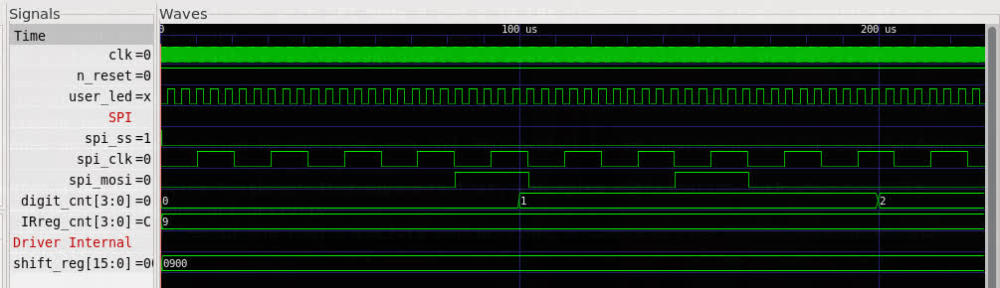
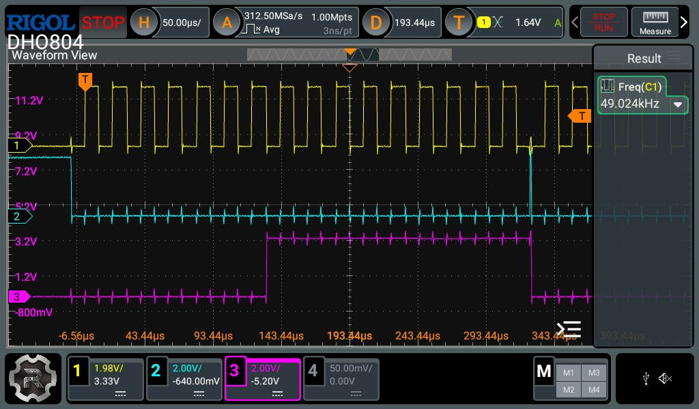

# MAX7219 8x8 LED Matrix Counter (Lattice ECP5)

This project implements a 0-9 digit counter displayed on a MAX7219-driven 8x8 LED matrix using a Colorlight 5A-75B (LFE5U-25) FPGA board.

## Hardware Setup

### Pin Mapping (Colorlight 5A-75B)
As defined in `Colorlight.lpf`:

| Signal | FPGA Pin | Wire Color (Typical) |
| :--- | :--- | :--- |
| **CLK (SPI)** | `G16` | Orange |
| **DIN (MOSI)** | `H14` | Blue |
| **CS / LOAD** | `F15` | Yellow |
| **n_reset** | `R7` | (Active Low / Pull-up enabled) |
| **user_led** | `T6` | (Heartbeat LED) |

**Power Requirements:**
- **VCC:** 5V (Standard for MAX7219)
- **GND:** Connect to any GND pin on the Colorlight board.

## Usage Instructions

### 1. Build and Upload (Hardware)
To compile the bitstream and program the board:
```bash
apio build
apio upload
```

### 2. Automated Testing (CLI)
To run the automated verification suite:
```bash
apio test
```

### 3. Graphical Simulation (GTKWave)
To inspect the SPI signals and internal states visually:
```bash
apio sim
```
This will open **GTKWave** with the predefined `main_tb.gtkw` configuration.

## Technical Details

- **System Clock:** 5 MHz (manually divided from the 25 MHz crystal).
- **SPI Clock:** ~50 kHz.
- **SPI Mode:** Mode 0 (Data stable before the rising edge of the clock).
- **Update Logic:** Burst updates (13 registers updated sequentially) triggered once per second.

### Simulation Analysis (`simulation.jpg`)



The simulation shows:
- **Heartbeat LED:** Toggling at the expected intervals.
- **SPI Burst:** The `spi_ss` line pulling low to initiate a sequence of 16-bit transfers.
- **Clock Alignment:** The `spi_clk` and `spi_mosi` lines showing precise Mode 0 timing where data is stable during the rising edge.

### Oscilloscope Analysis (`RigolDSwave1.jpg`)



This real-world capture confirms the robust SPI communication:
- **Blue Trace (CS/LOAD):** Pulls HIGH after 16 bits to latch data.
- **Yellow Trace (CLK):** Clean pulses at 50 kHz.
- **Signal Integrity:** Clear separation between data transitions and clock edges, ensuring the MAX7219 correctly samples each bit even with signal ringing.

## Credits
Based on the MAX7219 driver project.
- `MAX7219.v`: Core SPI Driver (Robust Mode 0)
- `usage_MAX7219.v`: 0-9 Counter and Font Logic (Burst update controller)
- `main.v`: Top-level wrapper and clock management
